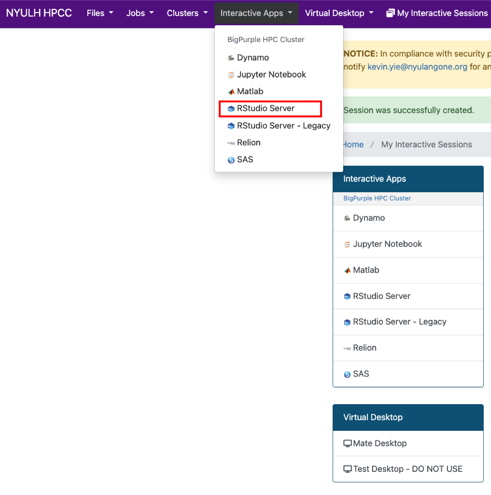

# Make an scRNAseqAPP

Create a [scRNAseqAPP](https://www.bioconductor.org/packages/release/bioc/html/scRNAseqApp.html) 

  1. load the conda environment via 'source /gpfs/data/cvrcbioinfolab/shared_conda_envs/condaload_sc_shiny_app.sh'
  
  2. Run 'Rscript --vanilla make_shiny_app.R' with the following positinal parameters
    
    1. Path of directory to use for the app data.
    2. Path of Seurat object.
    3. project name.
    4. data modality (has to be 1 of: scRNAseq, scATACseq, scMultiome).
    
    Here's an example command: Rscript --vanilla make_shiny_app.R '/gpfs/data/moorelab/gildem01/shiny_test/' '/gpfs/data/fisherlab/gildem01/Maria_NE/CITEseq_Human_CHORD_2024_05_24/08202024/QC/HCC4/HCC4.rds' 'HCC4' 'scRNAseq'
    
    5. This script generates an R script named 'sc_shiny_app_run.R'. This is what users will use this in the process to load the app.

to-do:

* Add a table as input so one can add multiple seurat objects
* Augment make_shiny_app.R to deal with above
* Will work with CITEseq and other assays but the nomenclature has to be worked around. 

*** 

# Load an scRNAseqAPP
Detailed tutorial for loading an app

## *Start an Rstudio server session via OnDemand*
  
  1. Open a browser and navigate to the ondemand web page (https://ondemand.hpc.nyumc.org/pun/sys/dashboard)
      - note: you'll need to be connected via VPN if you're not on the local network
  2. Login with your credentials
  3. Navigate to the Rstudio Server app page  
    
  4. Request an Rstudio Server session
    - Select 'Conda Environments' from the 'R version' tab.
    - 'Path to Conda Environment' - paste: /gpfs/data/cvrcbioinfolab/shared_conda_envs/sc_shiny_app
    - 'Partition' = select cpu_short.
    - 'Instance type' -  select Standard R Job.
    - 'Number of hours' - select time needed in hours.
    
    - click 'Launch'
    
  5. Load the session.

## *load the app*

  1. Within the R console run 'source directoryfromabove/sc_shiny_app_run.R'.
  2. Within the R console run 'scRNAseqApp(app_path = publish_folder)'.
  
    * A new browser window will pop up and the app will load.
    
    