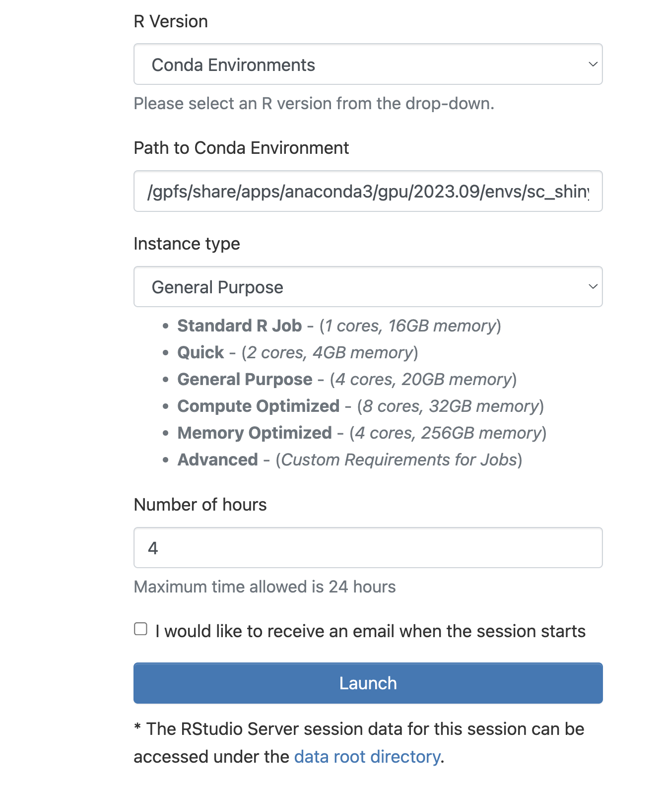

# Make an scRNAseqAPP
###### Update everything to load the conda module Kevin created module load condaenvs/new/sc_shiny_app 
Create a [scRNAseqAPP](https://www.bioconductor.org/packages/release/bioc/html/scRNAseqApp.html). This tutorial is for the bioinformatics team.

  1. load the conda environment via 

    ```
    module load condaenvs/new/sc_shiny_app
    
    ```

  2. Fill out samples.txt columns with:

    - object_path = path to seurat object
    - object_name = name of objects
    - modality = 1 of: scRNAseq, scATACseq, scMultiome
    - species = species

  3. Run 'Rscript --vanilla make_shiny_app.R' with the following positinal parameters
    
    - This script makes the database for the seurat objects included in samples.txt
    - Additionally, this script generates an R script named 'sc_shiny_app_run.R'. This is what users will use this in the process to load the app.
    - make sure you change permissions to the app folder and scripts.

to-do:

* Add a table as input so one can add multiple seurat objects
* Augment make_shiny_app.R to deal with above
* Will work with CITEseq and other assays but the nomenclature has to be worked around. 

*** 

# Load an scRNAseqAPP
Detailed tutorial for loading an app.

## *Start an Rstudio server session via OnDemand*
  
  1. Open a browser and navigate to the ondemand web page (https://ondemand.hpc.nyumc.org/pun/sys/dashboard)

      - note: you'll need to be connected via VPN if you're not on the local network

  2. Login with your credentials
  3. Navigate to the Rstudio Server app page  
    
  4. Request an Rstudio Server session

      - Select 'Conda Environments' from the 'R version' tab.
      - 'Path to Conda Environment' - paste: /gpfs/share/apps/anaconda3/gpu/2023.09/envs/sc_shiny_app
      - 'Partition' = select cpu_short.
      - 'Instance type' -  select Standard R Job.
      - 'Number of hours' - select time needed in hours.
      - click 'Launch'
      - The page should look like this:
    
    
  5. This will bring you to the 'My Interactive Sessions' tab. At first your job will say 'Queued', which means it's waiting in the queue. Once your job is exectued it will say 'Running'. At his point you can load the session by clicking 'Connect to Rstudio Server'
    
    


## *load the app*

  1. After clicking 'Connect to Rstudio Server', your Rstudio Server session will open. The screen will look like this:
    
  2. The R console is the box on the left that says 'console' on the top. Within the R console paste the command we sent you and hit enter. The command will look something like this: 

    ```
    source('/gpfs/data/lab/sc_shiny_app_run.R')
    ```

  3. Within the R console paste the following command and hit enter:
    
    ```
    scRNAseqApp(app_path = publish_folder)
    ```
      - A new browser window will pop up and the app will load.
    
    
